# Awesome Image Skills / 精选图像创作 Skills

> A curated list of skills, workflows, and open resources for AI image creation.  
> 一个精选的 AI 图像创作 Skill、工作流与开放资源目录。

> [!IMPORTANT]
> This directory includes both OSI-style open-source projects and source-available projects with restrictive licenses. Every entry states its license; check it before use.  
> 本目录同时收录 OSI 定义的开源项目与带限制许可的源码可用项目。每个条目均标注许可证；使用前请自行确认许可范围。

## Contents / 目录

- [Material Art & Illustration / 材料艺术与插画](#material-art--illustration--材料艺术与插画)
- [Posters, Print & Collage / 海报、印刷与拼贴](#posters-print--collage--海报印刷与拼贴)
- [Memory Artefacts & Collectibles / 记忆载体与收藏品](#memory-artefacts--collectibles--记忆载体与收藏品)
- [Brand & Food Visuals / 品牌与食物视觉](#brand--food-visuals--品牌与食物视觉)
- [Contributing / 贡献](#contributing--贡献)
- [License / 许可证](#license--许可证)

## Material Art & Illustration / 材料艺术与插画

- [ZONE-Material-art](https://github.com/joeyhu1108-maker/ZONE-Material-art) — Develops themes or photos into original material-based artwork, relief painting, installation concepts, and fabrication plans. / 将主题或照片转化为原创材料艺术、浮雕绘画、装置概念与制作方案。Creator / 署名：卓一_Z·ONE。`License not declared`
- [photo-to-minimal-illustration](https://github.com/iamkong/photo-to-minimal-illustration) — Translates photos into restrained Field Study editorial illustrations with warm paper, sparse ink lines, muted colors, and generous negative space. / 将照片转译为暖纸、克制墨线、低饱和色与大留白的 Field Study 编辑插画。Creator / 署名：iamkong。`MIT`

  **Visual demo / 视觉示例 — Public-domain source → Field Study output**

  <table>
    <tr><th>Before / 原图</th><th>After / Skill 生成结果</th></tr>
    <tr>
      <td>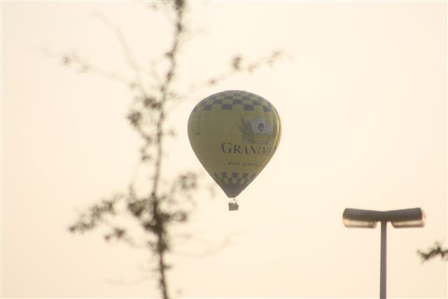</td>
      <td>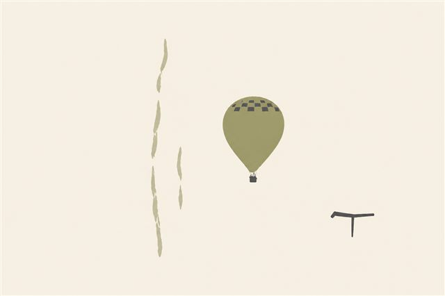</td>
    </tr>
  </table>

  Source: [Hot-air balloon.JPG by Antonio Borrillo](https://commons.wikimedia.org/wiki/File:Hot-air_balloon.JPG), CC0 1.0. Output created with the `photo-to-minimal-illustration` workflow. / 原图：Antonio Borrillo 的 CC0 1.0 作品；右图由 `photo-to-minimal-illustration` 工作流生成。See [attribution](assets/photo-to-minimal-illustration-demo/ATTRIBUTION.md).
- [photo-to-travel-sketch](https://github.com/liigoQi/photo-to-travel-sketch) — Turns travel photos into loose observational sketchbook drawings with wandering fineliner contours and dry-marker color. / 将旅行照片转为松弛的观察式速写本画面，使用游走针管线与干性马克笔色彩。Creator / 署名：小灯只工作不上班。`MIT`

  **Visual demo / 视觉示例 — Public-domain source → Travel Sketch output**

  <table>
    <tr><th>Before / 原图</th><th>After / Skill 生成结果</th></tr>
    <tr>
      <td>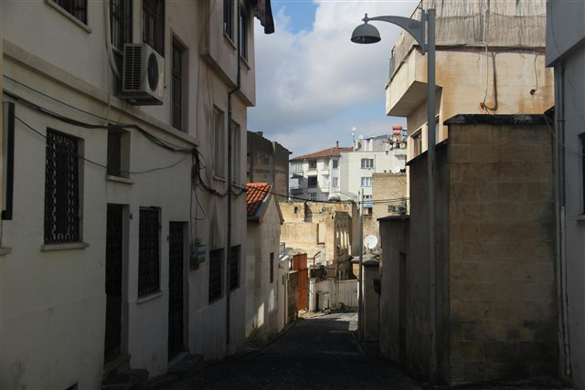</td>
      <td>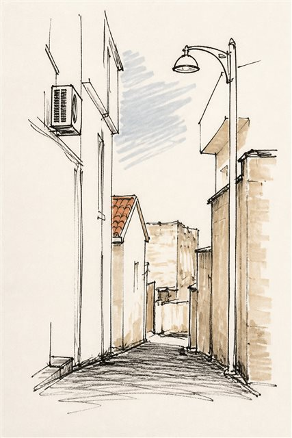</td>
    </tr>
  </table>

  Source: [Narrow Urban Street with Mediterranean Architecture by Ralawin60](https://commons.wikimedia.org/wiki/File:Narrow_Urban_Street_with_Mediterranean_Architecture.jpg), CC0 1.0. Output created with the `photo-to-travel-sketch` workflow. / 原图：Ralawin60 的 CC0 1.0 作品；右图由 `photo-to-travel-sketch` 工作流生成。See [attribution](assets/photo-to-travel-sketch-demo/ATTRIBUTION.md).
- [scene-to-art-lab](https://github.com/N1kO724/scene-to-art-lab) — Builds art-directed posters from photographs, choosing media, composition, typography, and source-derived palettes. / 从照片出发选择媒介、构图、字排与源图色彩，生成艺术指导式海报。Creator / 署名：N1ko。`Personal Non-Commercial`

  **Visual demo / 视觉示例 — Curated source → Art-directed Poster output**

  <table>
    <tr><th>Before / 原图</th><th>After / Skill 生成结果</th></tr>
    <tr>
      <td>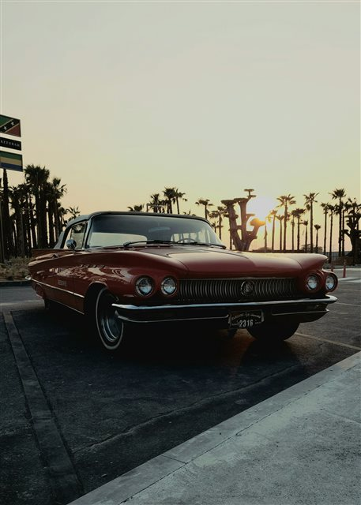</td>
      <td>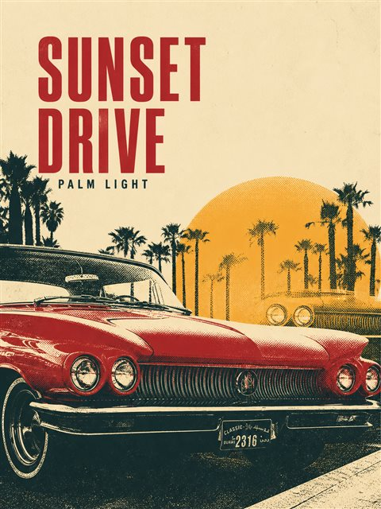</td>
    </tr>
  </table>

  Source: [Sunset by the Palm-Lined Road by Pramod Tiwari](https://unsplash.com/pt-br/fotografias/um-carro-vermelho-dirigindo-pelo-deserto-ao-por-do-sol-av4RwWsXtSk), under the [Unsplash License](https://unsplash.com/license). Output created with the `scene-to-art-lab` workflow. / 原图：Pramod Tiwari 的 Unsplash 许可作品；右图由 `scene-to-art-lab` 工作流生成。See [attribution](assets/scene-to-art-lab-demo/ATTRIBUTION.md).
- [sunwoven-reverie](https://github.com/wen3140/sunwoven-reverie) — Repaints people, pets, and scenes as modern flat illustrations with geometric color fields and a single bold graphic event. / 用几何色块、有限色盘与单一醒目图形事件重绘人物、宠物与风景。Creator / 署名：云间一纸书。`PolyForm Noncommercial 1.0.0`

  **Visual demo / 视觉示例 — Curated source → Sunwoven Illustration output**

  <table>
    <tr><th>Before / 原图</th><th>After / Skill 生成结果</th></tr>
    <tr>
      <td>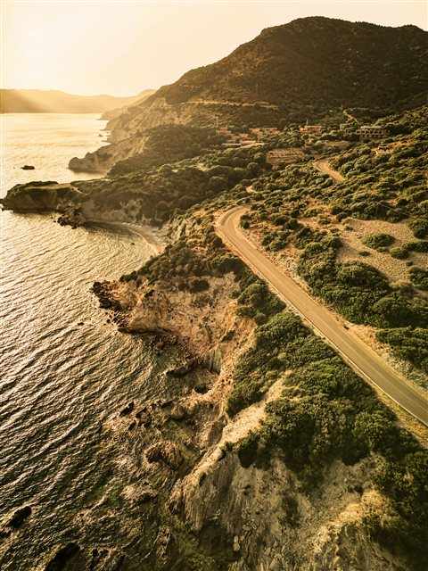</td>
      <td>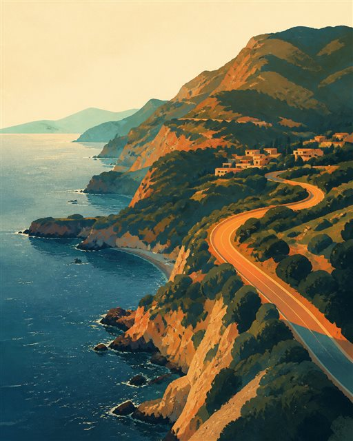</td>
    </tr>
  </table>

  Source: [Coastal Cliffside Drive by Peter Thomas](https://unsplash.com/photos/a-scenic-view-of-the-ocean-and-a-road-eypFi21fcXI), under the [Unsplash License](https://unsplash.com/license). Output created with the `sunwoven-reverie` workflow. / 原图：Peter Thomas 的 Unsplash 许可作品；右图由 `sunwoven-reverie` 工作流生成。See [attribution](assets/sunwoven-reverie-demo/ATTRIBUTION.md).
- [selective-ink-sketch](https://github.com/joeyhu1108-maker/selective-ink-sketch) — Converts real photos into black-and-white pen sketches that privilege one detailed anchor and purposeful omission. / 将真实照片转为黑白钢笔速写，以一个精刻锚点和主动省略建立画面。Creator / 署名：卓一_Z.ONE。`License not declared`

  **Visual demo / 视觉示例 — Curated source → Selective Ink Sketch output**

  <table>
    <tr><th>Before / 原图</th><th>After / Skill 生成结果</th></tr>
    <tr>
      <td>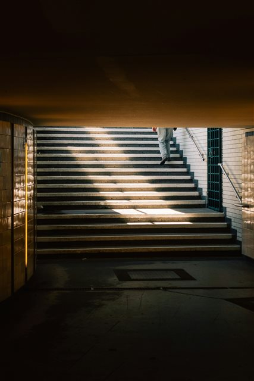</td>
      <td>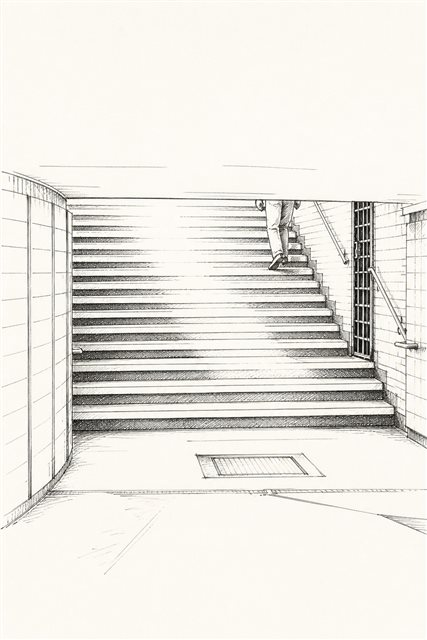</td>
    </tr>
  </table>

  Source: [Someone walks up stairs into sunlight by Willi Nüchterlein](https://unsplash.com/photos/someone-walks-up-stairs-into-sunlight-e-2NTM8fDKs), under the [Unsplash License](https://unsplash.com/license). Output created with the `selective-ink-sketch` workflow. / 原图：Willi Nüchterlein 的 Unsplash 许可作品；右图由 `selective-ink-sketch` 工作流生成。See [attribution](assets/selective-ink-sketch-demo/ATTRIBUTION.md).
- [flash4start_light](https://github.com/Buantum/flash4start_light) — Uses structural image analysis to guide tailored painterly SVG repaints and reproducible visual workflows. / 通过图像结构分析指导定制化的绘画式 SVG 重绘与可复现视觉工作流。Creator / 署名：LensWalker。`License not declared`

  **Visual demo / 视觉示例 — Curated source → Painterly SVG output**

  <table>
    <tr><th>Before / 原图</th><th>After / Skill 生成结果</th></tr>
    <tr>
      <td>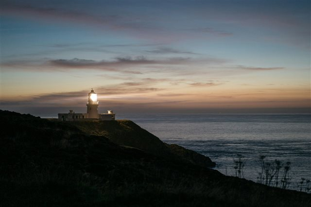</td>
      <td>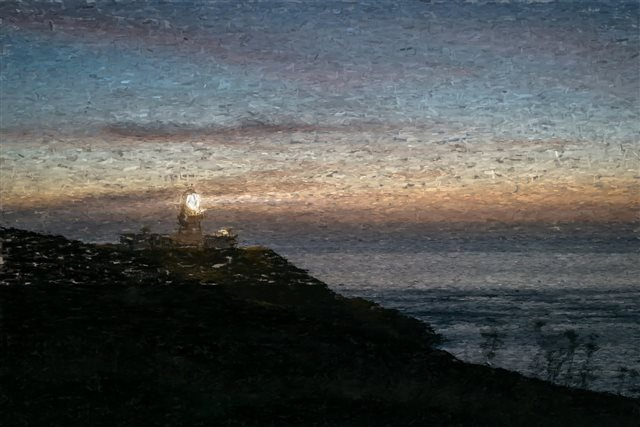</td>
    </tr>
  </table>

  Source: [a lighthouse on a hill overlooking the ocean by Tom Allport](https://unsplash.com/photos/a-lighthouse-on-a-hill-overlooking-the-ocean-0_gUGvfBbW4), under the [Unsplash License](https://unsplash.com/license). Output created with the `flash4start_light` workflow. / 原图：Tom Allport 的 Unsplash 许可作品；右图由 `flash4start_light` 工作流生成。See [attribution](assets/flash4start-light-demo/ATTRIBUTION.md).
- [antibes-holiday](https://github.com/haorantang97/antibes-holiday) — Creates relaxed black-pen narrative illustrations using expressive marks, causal staging, and active blank space. / 以表现性笔触、叙事性场景与主动留白创作松弛的黑笔插画。Creator / 署名：Lab 305。`PolyForm Noncommercial 1.0.0`

  **Visual demo / 视觉示例 — Curated source → Relaxed Black-Pen output**

  <table>
    <tr><th>Before / 原图</th><th>After / Skill 生成结果</th></tr>
    <tr>
      <td>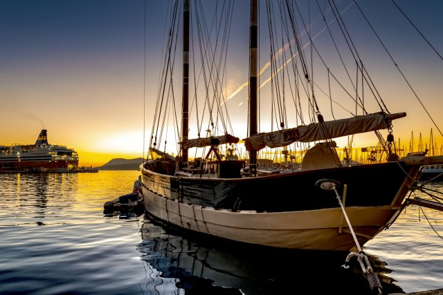</td>
      <td>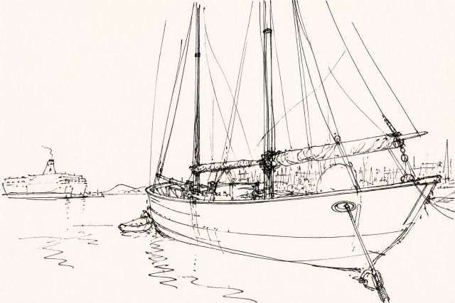</td>
    </tr>
  </table>

  Source: [Sailboat docked in harbor at sunset by Philippe BONTEMPS](https://unsplash.com/photos/sailboat-docked-in-harbor-at-sunset-oOkaTgp0OZc), under the [Unsplash License](https://unsplash.com/license). Output created with the `antibes-holiday` workflow. / 原图：Philippe BONTEMPS 的 Unsplash 许可作品；右图由 `antibes-holiday` 工作流生成。See [attribution](assets/antibes-holiday-demo/ATTRIBUTION.md).

## Posters, Print & Collage / 海报、印刷与拼贴

- [Gathered Scenes Zine](https://github.com/Zeejay0/gathered-scenes-zine-skill) — Two Codex image-creation skills that transform an ordinary photo into either a tactile photo-collage zine page or a newly distilled editorial illustration. / 两个 Codex 图像创作 Skill：将日常照片转化为带纸张质感的实景拼贴纸刊，或重新蒸馏为独立的编辑插画。`Personal Non-Commercial`
- [reality-restaged](https://github.com/traveler0621/reality-restaged) — Restages documentary and travel photography as restrained surreal cinematic tableaux while preserving people, gestures, and cultural memory. / 在保留人物、动作与文化记忆的前提下，将纪实和旅行摄影重构为克制的超现实电影场景。Creator / 署名：旅人编号0621。`License not declared`
- [silhouette-group-collage](https://github.com/liuzihe849-png/silhouette-group-collage) — Turns group photos into handmade-paper diptychs with complementary silhouette masks while preserving the original people and scene pixels. / 将群像照片制作成正负形互补的手工纸双联画，并保留原图人物和场景像素。Creator / 署名：理智画。`MIT`
- [eastern-ink-photo-diptych](https://github.com/Hiseaa/eastern-ink-photo-diptych) — Makes a vertical editorial poster with faithful photography above and minimalist Eastern ink abstraction below. / 制作上半实景摄影、下半东方极简水墨的竖版画册海报。Creator / 署名：长曝研究院 × 柳生。`License not declared`
- [surreal-pop-collage](https://github.com/2998980-hue/surreal-pop-collage) — Recasts a photo as a surreal pop collage with a monochrome reality anchor, flat color fields, and one impossible oversized element. / 以黑白现实锚点、平涂色块和唯一不可能巨物，将照片转为超现实波普拼贴。Creator / 署名：理想鲨鱼。`MIT`

  **Visual demo / 视觉示例 — Curated source → Surreal Pop Collage output**

  <table>
    <tr><th>Before / 原图</th><th>After / Skill 生成结果</th></tr>
    <tr>
      <td>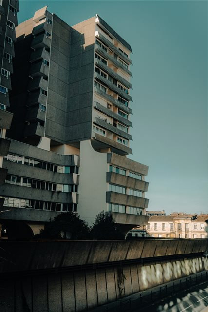</td>
      <td>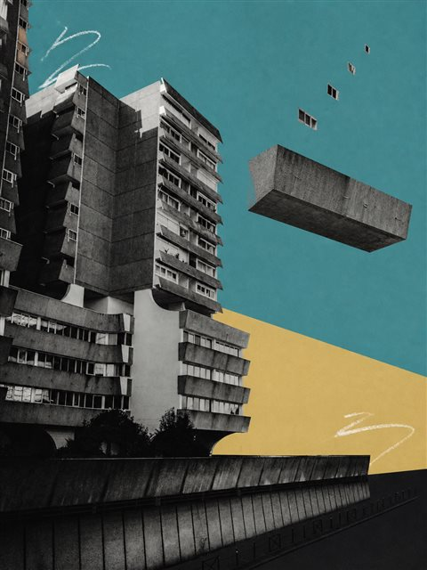</td>
    </tr>
  </table>

  Source: [Golden Sunset on Concrete Architecture by David Kristianto](https://unsplash.com/photos/le-coucher-du-soleil-projette-une-lumiere-doree-sur-un-batiment-_JbYKSye9OU), under the [Unsplash License](https://unsplash.com/license). Output created with the `surreal-pop-collage` workflow. / 原图：David Kristianto 的 Unsplash 许可作品；右图由 `surreal-pop-collage` 工作流生成。See [attribution](assets/surreal-pop-collage-demo/ATTRIBUTION.md).
- [photo-riso-poster](https://github.com/luckdvr/photo-riso-poster) — Builds quiet 2–3 ink risograph archive posters from a photo or text theme through evidence-based abstraction. / 从照片或文字主题出发，以基于视觉证据的抽象生成安静的 2–3 色 Riso 档案海报。Creator / 署名：咕咕咕咕咕 / 嵩鼠。`MIT`

  **Visual demo / 视觉示例 — Public-domain source → Riso Archive Poster output**

  <table>
    <tr><th>Before / 原图</th><th>After / Skill 生成结果</th></tr>
    <tr>
      <td>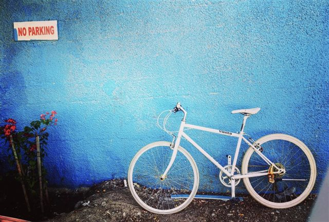</td>
      <td>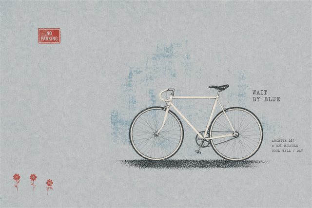</td>
    </tr>
  </table>

  Source: [White bicycle by Fasalul Abid Shj](https://commons.wikimedia.org/wiki/File:White_bicycle.jpg), CC0 1.0. Output created with the `photo-riso-poster` workflow. / 原图：Fasalul Abid Shj 的 CC0 1.0 作品；右图由 `photo-riso-poster` 工作流生成。See [attribution](assets/photo-riso-poster-demo/ATTRIBUTION.md).
- [create-pantone-photo-posters](https://github.com/laurent-7bk/Aigc-Skills/tree/main/create-pantone-photo-posters) — Designs framed editorial photo posters with restrained out-of-frame subjects and visually approximate Pantone-style color labels. / 以克制的穿框主体与视觉近似的潘通式色号标签，制作相框摄影编辑海报。Creator / 署名：Laurent。`License not declared; personal non-commercial notice`

## Memory Artefacts & Collectibles / 记忆载体与收藏品

- [skill-make-photo-stamp-archive](https://github.com/Dlcccc71913/skill-make-photo-stamp-archive) — Pairs a faithful photo with a custom tactile stamp panel to make restrained archival compositions. / 将真实照片与定制的手压图章纸面并置，制作克制的档案式拼接作品。Creator / 署名：Dlcccc71913。`MIT`

  **Visual demo / 视觉示例 — Public-domain source → Photo Stamp Archive output**

  <table>
    <tr><th>Before / 原图</th><th>After / Skill 生成结果</th></tr>
    <tr>
      <td>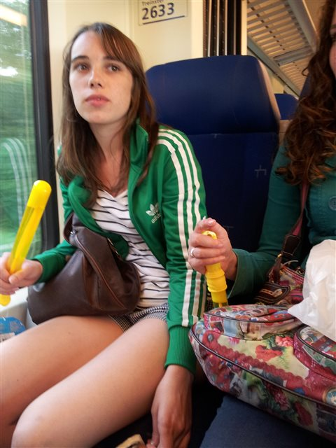</td>
      <td>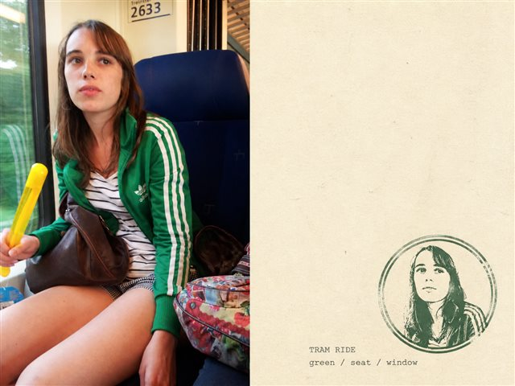</td>
    </tr>
  </table>

  Source: [Passenger Tram Rotterdam by Prolete](https://commons.wikimedia.org/wiki/File:Passenger_Tram_Rotterdam.jpg), CC0 1.0. Output created with the `skill-make-photo-stamp-archive` workflow. / 原图：Prolete 的 CC0 1.0 作品；右图由 `skill-make-photo-stamp-archive` 工作流生成。See [attribution](assets/skill-make-photo-stamp-archive-demo/ATTRIBUTION.md).
- [travel-memory-sticker-card](https://github.com/carolinaaafy/travel-memory-sticker-card) — Turns travel photos into collectible memory sticker cards. / 将旅行照片制作成可收藏的记忆贴纸卡。Creator / 署名：Carito。`License not declared`
- [travel-memory-card-duo](https://github.com/carolinaaafy/travel-memory-card-duo) — Produces a 3:2 travel memory card plus a matching six-sticker PNG with a transparent background. / 输出一张 3:2 旅行记忆卡，以及同款六枚透明底贴纸 PNG。Creator / 署名：Carito。`License not declared`
- [vinyl-image-generator](https://github.com/liigoQi/vinyl-image-generator) — Creates a cohesive fictional vinyl-release artifact: front and back sleeves plus two record labels in one product image. / 在一张产品图中生成统一的虚构黑胶唱片作品：正反封套与 A/B 面唱片标签。Creator / 署名：Yosemite。`MIT`

## Brand & Food Visuals / 品牌与食物视觉

- [heytea-style](https://github.com/Hchen1218/heytea-style) — An unofficial, HEYTEA-inspired workflow that combines one real object with childlike doodles and hand-drawn Chinese typography. / 非官方、受喜茶海报语言启发的工作流：以真实物件结合儿童涂鸦和手写中文标题。Creator / 署名：设计goo。`License not declared`
- [heytea-creative-style](https://github.com/shouna12358-png/heytea-creative-style) — Turns food photos into white-background promotional posters with real food, playful line-drawn stories, and two child-handwriting variants. / 将食物照片做成纯白背景宣传海报，结合真实食物、童趣线描叙事与两款儿童手写标题。Creator / 署名：设计goo。`MIT`

## Contributing / 贡献

Have a useful image-creation skill or workflow? Please read [CONTRIBUTING.md](CONTRIBUTING.md) before opening an issue or pull request.  
发现了值得收录的图像创作 Skill 或工作流？请先阅读 [CONTRIBUTING.md](CONTRIBUTING.md)，再提交 Issue 或 Pull Request。

## License / 许可证

This list is released under [CC0-1.0](LICENSE). Individual projects retain their own licenses.  
本目录以 [CC0-1.0](LICENSE) 发布；各收录项目仍适用其自身许可证。
